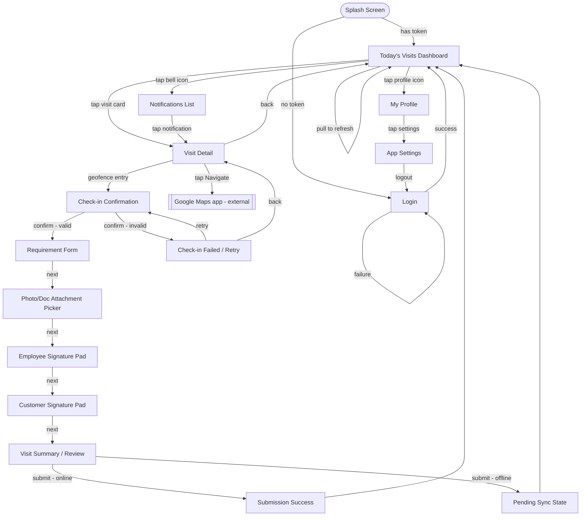

# FieldTrack Pro — Navigation Flow
### Phase 2.5 — UX & Wireframes (continued)

Screen-to-screen navigation maps for both apps, built directly from the two Screen List docs. This is what defines the actual navigation graph (bottom nav vs. stack nav, modal vs. full-screen push) — the piece Antigravity needs to wire up routing correctly instead of guessing at transitions.

---

## 1. Android — Navigation Flow

**Navigation pattern**: single-stack push navigation throughout — no bottom tab bar needed for MVP given the app is fundamentally a linear "one visit at a time" workflow, not a multi-section app. Dashboard is the only true "home," everything else is a forward path that returns to it.

---

## 2. Web Dashboard — Navigation Flow

```mermaid
flowchart TD
    Login([Admin Login]) -->|success| Overview[Dashboard Overview]

    Overview -->|sidebar: Employees| EmpList[Employee List]
    Overview -->|sidebar: Customers| CustList[Customer List]
    Overview -->|sidebar: Visits| VisitBoard[Visit Status Board]
    Overview -->|sidebar: Reports| Reports[Reports Landing]
    Overview -->|sidebar: Settings| AdminSettings[Admin Settings]
    Overview -->|expand map| LiveMap[Live Map full view]

    EmpList -->|Add Employee| EmpAdd[Add Employee]
    EmpList -->|row click| EmpDetail[Employee Detail]
    EmpDetail -->|edit| EmpEdit[Edit Employee]
    EmpAdd -->|save| EmpList
    EmpEdit -->|save| EmpDetail

    CustList -->|Add Customer| CustAdd[Add Customer]
    CustList -->|row click| CustDetail[Customer Detail]
    CustDetail -->|edit| CustEdit[Edit Customer]
    CustAdd -->|save| CustList
    CustEdit -->|save| CustDetail

    VisitBoard -->|Schedule Visit| ScheduleVisit[Schedule Visit]
    VisitBoard -->|Bulk Schedule| BulkSchedule[Bulk Schedule Visits]
    VisitBoard -->|card click| VisitDetailAdmin[Visit Detail - Admin view]
    VisitBoard -->|flagged filter| FlaggedReview[Flagged Visit Review]
    ScheduleVisit -->|save| VisitBoard
    BulkSchedule -->|save| VisitBoard
    FlaggedReview -->|resolve| VisitBoard

    Reports -->|tab| EmpReport[Employee Visit Report]
    Reports -->|tab| CustReport[Customer Visit History]
    Reports -->|tab| Productivity[Productivity Dashboard]
    Reports -->|tab| GeoReport[Geo-verification Report]
    EmpReport -->|export| ExportModal[[Export Modal]]
    CustReport -->|export| ExportModal
    Productivity -->|export| ExportModal
    GeoReport -->|export| ExportModal

    AdminSettings -->|manage| Territories[Territory Management]
    AdminSettings -->|manage| ReqCategories[Requirement Category Management]
    AdminSettings -->|logout| Login
```

**Navigation pattern**: persistent sidebar layout (standard admin dashboard convention) — every major section is one click away at all times, unlike the Android app's linear stack. Reports use tabs rather than separate page navigations since they share the same filter/export chrome.

---

## 3. Cross-App Navigation Touchpoint

The two apps don't navigate into each other directly (no deep-linking between Android and Web in MVP), but they're navigationally connected through shared data:

- A visit created in **Web: Schedule Visit** appears in **Android: Dashboard** without any explicit navigation trigger — this is a data-sync connection, not a screen-to-screen one, worth noting so it isn't mistaken for a missing navigation link during build.
- **Web: Flagged Visit Review** and **Android: Check-in Failed** are two views of the same underlying event (a failed geo-verification) — they should reference the same reason codes/data shape so the admin's view of "why this failed" always matches what the employee actually saw in the field.

---

## Phase 2.5 — Complete

Six pieces done: **Android Screen List → Web Dashboard Screen List → User Journey → Low-Fidelity Wireframes → Navigation Flow.** Combined with Phase 1 (5 docs) and Phase 2 (5 docs), you now have 16 planning artifacts — full spec, UX, and navigation — before any backend code gets written.

**Next up:** Phase 3 — Backend Development (Spring Boot Setup, Authentication, APIs, Database, Business Logic).
