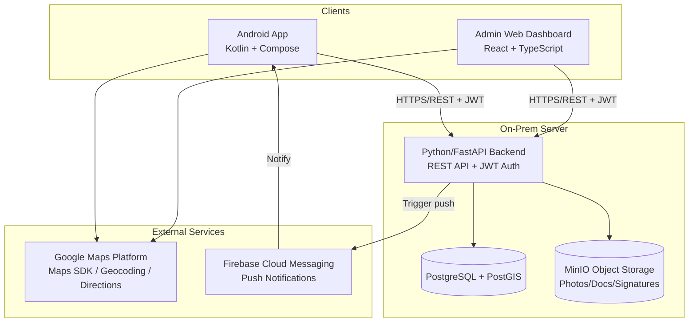
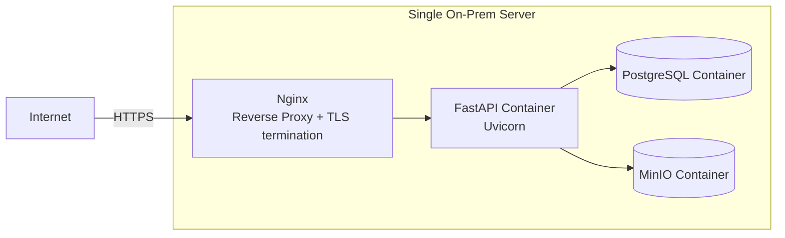

# FieldTrack Pro — Architecture
### Phase 1.5 — Product Discovery & Planning (Final piece of Phase 1)
### Revision 2 — Backend migrated from Java/Spring Boot to Python/FastAPI

---

## 1. High-Level System Architecture

Three client surfaces, one backend, on-prem infrastructure. No microservices, no cloud lock-in — matches the Tech Stack decisions.



Only node **C** changed from the original diagram — same protocol (HTTPS/REST + JWT), same downstream dependencies (Postgres, MinIO, Maps, FCM). Android and Web integrate against the exact same contract either way.

---

## 2. Backend Architecture (FastAPI Application, Layered)

```
app/
├── main.py           → FastAPI app entrypoint, router registration, startup/shutdown hooks
├── config.py          → pydantic-settings: env-driven config (DB URL, JWT secret, MinIO, CORS origins)
├── database.py         → SQLAlchemy async engine + session factory
├── api/                 → FastAPI routers (REST endpoints — thin, no business logic)
├── services/             → Business logic (visit lifecycle, geo-verification, reports)
├── models/                → SQLAlchemy ORM models (User, Customer, Visit, RequirementForm, etc.)
├── schemas/                → Pydantic request/response models (never expose ORM models directly)
├── security/                → JWT handling, auth dependencies, role checks, rate limiter
├── geo/                       → Geo-fence verification logic (GeoAlchemy2/PostGIS queries)
├── storage/                    → MinIO upload/download service
├── notification/                 → FCM integration, notification triggers
└── exceptions/                    → Custom exceptions + global exception handlers
```

**Why layered and not microservices (reaffirming the Tech Stack call — this reasoning didn't change with the language):** every module in the Features doc (Auth, Visits, GPS, Reports) shares the same database and the same deployment lifecycle. Splitting these into separate services would mean network calls for what should be a single transaction (e.g., "check in" touches Visit status, GPS log, and notification trigger together) — that's a distributed-systems problem this product doesn't have, in Python or Java.

---

## 3. Data Flow — Core Journey (Check-in → Sync → Report)

This is the flow that matters most, since it's the product's entire reason for existing (anti-fake-visit verification). **Unchanged from the original architecture** — the backend's internal implementation language doesn't affect the sequence of events:

1. **Android app** reads device GPS via Fused Location Provider.
2. On geo-fence entry, app sends check-in request (`POST /visits/{id}/check-in`) with GPS coordinates + timestamp to the **FastAPI backend**.
3. Backend's **geo verification service** re-validates coordinates server-side using PostGIS (`ST_DWithin`, via GeoAlchemy2) against the customer's stored geo-fence — client-side GPS is never trusted alone (per E5).
4. If valid → visit status updated to `IN_PROGRESS` in **PostgreSQL**, response sent back to app.
5. If invalid → request rejected, app shows retry state, and repeated failures get logged for the **Geo-verification Report** and trigger an **admin alert** via FCM.
6. Employee completes requirement form + uploads photos/signatures → files go to **MinIO**, form data to **PostgreSQL**, visit status → `COMPLETED`.
7. If offline at any point → all of the above happens against the local **Room DB** first, then a **WorkManager** background job replays the same API calls once connectivity returns.
8. **Admin dashboard** queries the same backend APIs to render live status board, reports, and analytics — no separate data path, single source of truth.

---

## 4. Security Architecture

- All client-backend traffic over **HTTPS/TLS**, even on-prem (self-signed or internal CA cert acceptable for pilot).
- **JWT access tokens** (short-lived, ~15 min, signed HS256 via `python-jose`) + **refresh tokens** (longer-lived, stored securely — Android Keystore, httpOnly cookie for web).
- **Role-based authorization** enforced through FastAPI `Depends()` guards checked on every route, not just UI-level hiding of buttons — an employee's JWT literally cannot call admin-only endpoints, regardless of what the Android app does or doesn't show.
- **Server-side geo-fence validation is mandatory** (E5) — this is the architectural backbone that makes the whole "eliminate fake visit reporting" pitch actually true rather than trust-the-client theater. This did not change with the migration.
- File uploads (G5) validated for type/size server-side (via `python-magic`) before ever reaching MinIO — never trust client-declared MIME types.

---

## 5. Deployment Topology (On-Prem)



- All four services run as **Docker containers via Docker Compose** on one on-prem machine for MVP.
- **Nginx** handles TLS termination and reverse-proxies to the FastAPI container — also serves the built React dashboard as static files. Nginx configuration is otherwise unchanged (see Deployment doc).
- Android app talks to the same public-facing endpoint via mobile data/WiFi — no VPN requirement assumed unless the org's network policy demands it (flag this if true — it changes Phase 9 deployment steps).
- This topology can scale later (separate DB server, load balancer, multiple app containers) without an architecture rewrite — deliberately kept simple for MVP, not because it can't grow. Horizontal scaling of the FastAPI container is in fact simpler than the original JVM containers (faster cold start, lower per-instance memory footprint), a small incidental benefit of the migration, not a reason it was made.

---

## Phase 1 — Complete (Revised)

You now have all five pieces, updated for the Python backend: **Requirements → User Flows → Features → Tech Stack → Architecture.** This set of five docs is your full grounding context — feed all of them to Antigravity before Phase 2 (System Design) so every downstream prompt has the same source of truth and nothing drifts between sessions.

**Next up:** Phase 2 — System Design (Database Design, API Design, Folder Structure, Security Design, ER Diagrams).
