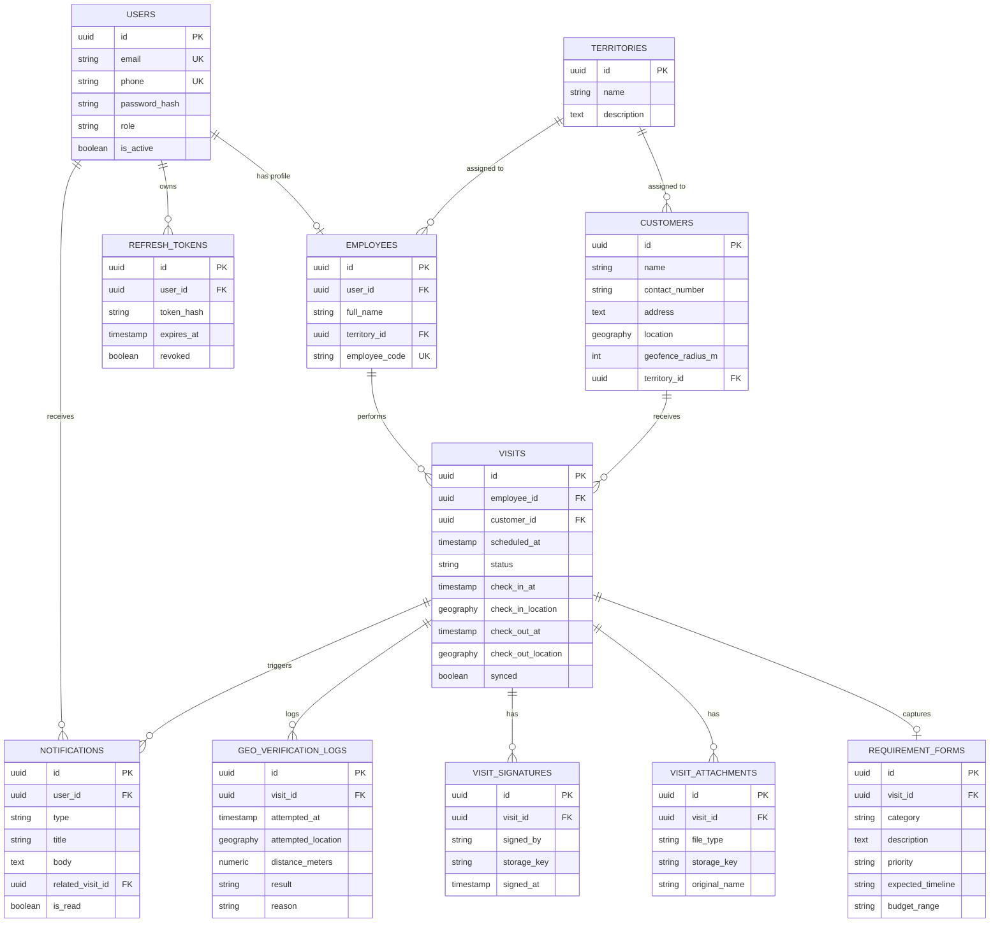
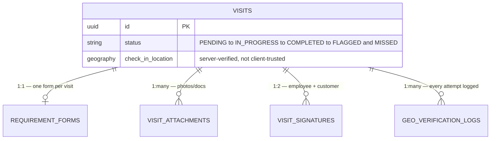

# FieldTrack Pro — ER Diagrams
### Phase 2.5 — System Design (Final piece of Phase 2)

Visual representation of the schema from Database Design. One full diagram, plus a zoomed-in view of the core `visits` cluster since that's where most of the product's complexity lives.

---

## 1. Full Entity-Relationship Diagram

---

## 2. Core Cluster — The "Visit Lifecycle" (Zoomed In)

This is the part of the schema that carries the actual product logic — worth isolating since it's what Phase 3 backend work and Phase 4 GPS work will spend the most time on.

**Reading this cluster**: a single `visits` row is the anchor for everything else — one requirement form, N attachments, up to 2 signatures (enforced at application level, not DB constraint, since `signed_by` allows exactly EMPLOYEE or CUSTOMER but nothing stops duplicate submissions without a unique constraint — see note below), and N geo-verification log entries (every check-in attempt, not just the successful one).

---

## 3. Relationship Notes & Constraints Worth Calling Out

- **`visits.employee_id` and `visits.customer_id` are both mandatory** — a visit cannot exist without both. No "draft visit" concept in MVP.
- **`requirement_forms` is 1:1 with `visits`** via a unique constraint on `visit_id` — enforced in Database Design already, restated here since it's easy to miss in a plain schema listing.
- **`visit_signatures` should have a unique constraint on `(visit_id, signed_by)`** — this wasn't explicit in the Database Design DDL and is worth adding now: without it, nothing stops two "EMPLOYEE" signature rows for the same visit. Small gap, easy fix, flagging before Phase 3 build starts.
- **`geo_verification_logs` has no foreign key back from `visits`** — it's intentionally one-directional (logs reference the visit, not the other way around) since a visit can have zero, one, or many verification attempts, and the visit itself only cares about its final `check_in_location`/`check_out_location`, not the full attempt history.
- **`notifications.related_visit_id` is nullable** — not every notification is visit-related (e.g., account-level notices in the future), so this FK is optional by design, not an oversight.

---

## Phase 2 — Complete

Five pieces done: **Database Design → API Design → Folder Structure → Security Design → ER Diagrams.** Combined with the five Phase 1 docs, you now have a full spec Antigravity can build against without guessing at any structural decision.

**Next up:** Phase 3 — Backend Development (Spring Boot Setup, Authentication, APIs, Database, Business Logic) — this is where agents start actually writing code.
