# 📘 FieldTrack Pro — Complete Operations & Feature User Manual

**Enterprise Field Force Intelligence, Telemetry, Credit Recovery & Operations Command Center**

---

## 📑 Table of Contents
1. [🌐 System URLs & Quick Access](#1--system-urls--quick-access)
2. [🔑 Login Credentials Reference](#2--login-credentials-reference)
3. [🏗️ High-Level System Architecture & Data Flow](#3-%EF%B8%8F-high-level-system-architecture--data-flow)
4. [🧭 Feature-by-Feature Operational Guide](#4--feature-by-feature-operational-guide)
   - [4.1 Command Center & Financial Dashboard](#41-command-center--financial-dashboard)
   - [4.2 Employee & Field Force Management](#42-employee--field-force-management)
   - [4.3 Territory & Zone Hierarchy](#43-territory--zone-hierarchy)
   - [4.4 Customers & Retail Outlets Master](#44-customers--retail-outlets-master)
   - [4.5 Live Spatial Telemetry Map](#45-live-spatial-telemetry-map)
   - [4.6 Visit Dispatch & Execution Tracking](#46-visit-dispatch--execution-tracking)
   - [4.7 Geo Logs & Anti-Fraud Mock Detection](#47-geo-logs--anti-fraud-mock-detection)
   - [4.8 Dynamic Requirement Form Builder](#48-dynamic-requirement-form-builder)
   - [4.9 Payment Collections & Verification Workbench](#49-payment-collections--verification-workbench)
   - [4.10 Excel / MIS Bulk Ingestion Engine](#410-excel--mis-bulk-ingestion-engine)
   - [4.11 Business Intelligence & Financial Reporting](#411-business-intelligence--financial-reporting)
   - [4.12 System Diagnostics & Settings](#412-system-diagnostics--settings)
5. [🔄 End-to-End Operational Workflows](#5--end-to-end-operational-workflows)

---

## 1. 🌐 System URLs & Quick Access

| Tier | Service Name | URL | Purpose |
| :--- | :--- | :--- | :--- |
| **Web Frontend (Production)** | **FieldTrack Pro Vercel** | [https://fieldtrack-pro-rosy.vercel.app](https://fieldtrack-pro-rosy.vercel.app) | Admin & Executive Web Operations Portal |
| **Backend API (Production)** | **FastAPI on Render** | [https://fieldtrackpro-backend-s7hs.onrender.com](https://fieldtrackpro-backend-s7hs.onrender.com) | REST API & WebSocket Telemetry Gateway |
| **Local Web Frontend** | **Vite Dev Server** | [http://localhost:5173](http://localhost:5173) | Local testing & development |
| **Local Backend API** | **Uvicorn / FastAPI** | [http://localhost:8000](http://localhost:8000) | Local API server |
| **API Documentation** | **FastAPI Swagger Docs** | [http://localhost:8000/docs](http://localhost:8000/docs) | Interactive OpenAPI 3.0 documentation |
| **Source Code** | **GitHub Repository** | [https://github.com/itripathiharsh/FIELD_TRACK_PRO](https://github.com/itripathiharsh/FIELD_TRACK_PRO) | Production code repository |

---

## 2. 🔑 Login Credentials Reference

> **Pro Tip:** In the login box, you can sign in using **Work Email** OR **Mobile Number (CUG)**.

### A. Leadership & Management Accounts (ADMIN Role)
- **Default Password:** `Password@123!`

| Full Name | Role / Working Profile | Email | Mobile (CUG) | Emp Code |
| :--- | :--- | :--- | :--- | :--- |
| **Neeraj Rajput** | **Sales Manager** | `neeraj.rajput@sgrgservices.com` | `9839011015` | `11015` |
| **Rohit Pathak** | **Director** | `rohit.pathak@sgrgservices.com` | `9839011030` | `11030` |
| **Sunil Trivedi** | **Director** | `sunil.trivedi@sgrgservices.com` | `9839011020` | `11020` |
| **Vinay Chaturvedi** | **Sales Manager** | `vinay.chaturvedi@sgrgservices.com` | `9839011027` | `11027` |

### B. System Super-Admin Account
- **Email:** `admin@fieldtrack.test`
- **Password:** `AdminPass123!`

### C. Field Executives & Officers (FOS / TSE Accounts)
- **Default Password:** `Password@123!` *(All 30 genuine employees 11001–11030)*

| Full Name | Designation | Email | Mobile (CUG) | Emp Code |
| :--- | :--- | :--- | :--- | :--- |
| **Sahil Verma** | FOS | `sahil.verma@sgrgservices.com` | `9839011001` | `11001` |
| **Raunak Sharma** | FOS | `raunak.sharma@sgrgservices.com` | `9839011002` | `11002` |
| **Yogesh Kumar** | FOS | `yogesh.kumar@sgrgservices.com` | `9839011003` | `11003` |
| **Amit Jaiswal** | FOS | `amit.jaiswal@sgrgservices.com` | `9839011004` | `11004` |
| **Sandeep Mishra** | FOS | `sandeep.mishra@sgrgservices.com` | `9839011005` | `11005` |

---

## 3. 🏗️ High-Level System Architecture & Data Flow

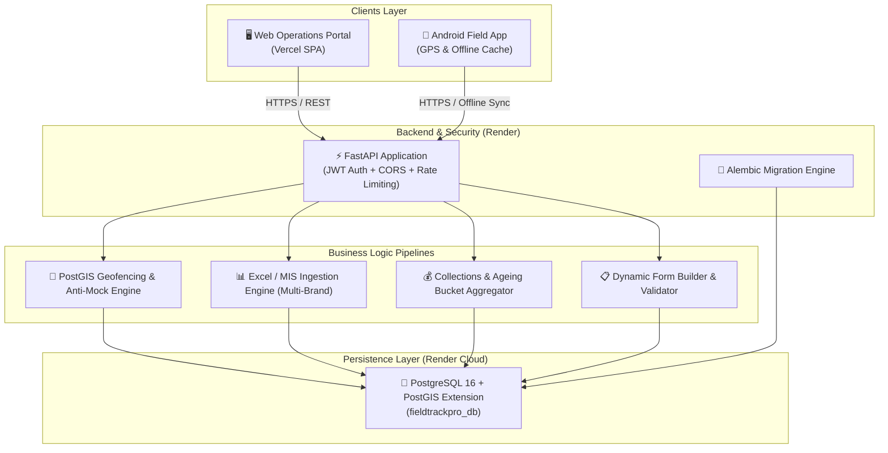

---

## 4. 🧭 Feature-by-Feature Operational Guide

---

### 4.1 Command Center & Financial Dashboard

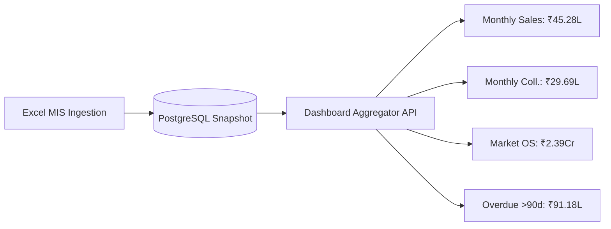

- **Purpose:** Central intelligence hub for senior executives to track macro-level field productivity, daily sales figures, collection targets, and overdue exposure.
- **What It Displays:**
  1. **Top Metrics Cards:**
     - **Active Field Force:** Real-time count of on-duty field staff.
     - **Total Assigned Outlets:** Active retail counters (359 SGRG outlets).
     - **Total Monthly Sales:** ₹45,28,432.59.
     - **Total Monthly Collections:** ₹29,69,383.00.
     - **Total Market Outstanding:** ₹2,39,57,499.89.
  2. **Ageing Exposure Chart:** Visual breakdown of outstanding receivables across `<15d`, `15-30d`, `30-45d`, `45-60d`, `60-75d`, `75-90d`, and `>90d`.
  3. **Operational Activity Feed:** Real-time telemetry feed of check-ins, exceptions, and collection submissions.
- **How to Use:**
  1. Navigate to `/dashboard` from the sidebar.
  2. Click any KPI card to drill down into the corresponding detail view.
  3. Use the date-range selector to filter performance by reporting period.

---

### 4.2 Employee & Field Force Management

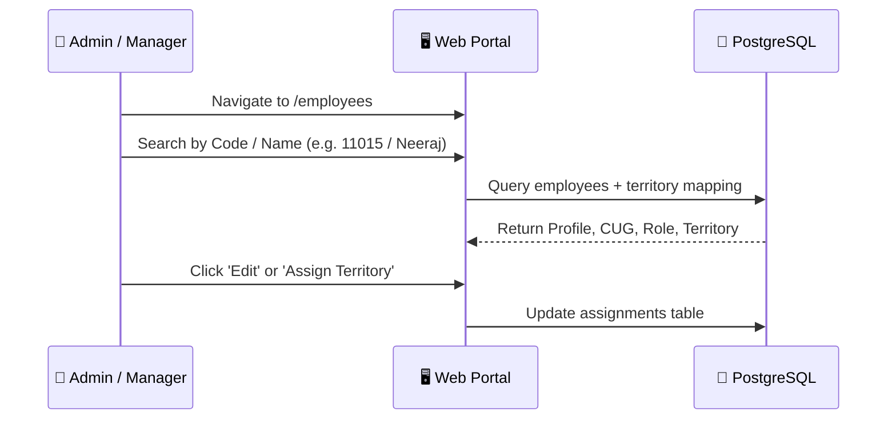

- **Purpose:** Manage the organizational hierarchy, field staff roster, CUG mobile numbers, and application roles.
- **What It Displays:**
  - Complete list of genuine SGRG employees (30 active staff: Telecom `11001–11020`, Consumer Electronics `11021–11030`).
  - Columns: **Employee Name**, **Employee Code**, **Working Profile** (Director, Sales Manager, TSE, FOS, Billing, Accountant), **CUG Mobile Number**, **Assigned Territory**, and **Status**.
- **How to Use:**
  1. Navigate to `/employees`.
  2. Use the top search bar to filter by employee code or name.
  3. Click **View Details** to inspect an executive's historical visit logs, assigned outlets, and performance metrics.

---

### 4.3 Territory & Zone Hierarchy

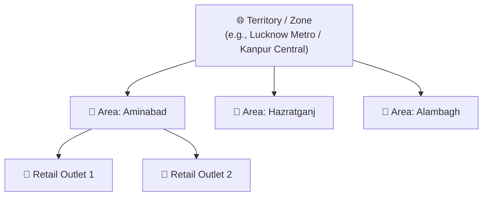

- **Purpose:** Organize geographical field distribution into manageable **Zones** and granular **Areas** for optimized field beat planning.
- **What It Displays:**
  - **25 Geographic Zones** covering Lucknow, Kanpur, and surrounding regions.
  - **162 Granular Areas** mapped to specific field beats.
  - Number of active customer outlets and assigned field executives per zone.
- **How to Use:**
  1. Open `/territories`.
  2. Click on a **Zone** to expand and view its mapped **Areas**.
  3. Click **Add Area** to create new operational beats.

---

### 4.4 Customers & Retail Outlets Master

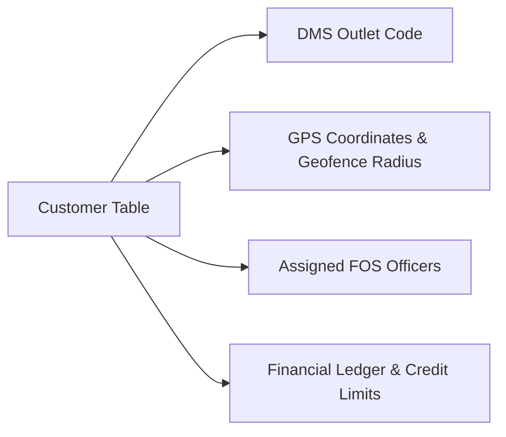

- **Purpose:** Complete directory of all retail counters, distribution hubs, and dealer outlets.
- **What It Displays:**
  - **359 Genuine SGRG Outlets** with client DMS codes (e.g., `50000000`, `50000001`, `50000002`...).
  - Assigned FOS executives, territory/area association, contact numbers, and physical addresses.
  - Individual outlet financial standing (Sales, Collections, Ledger Balance, and Overdue Ageing).
- **How to Use:**
  1. Open `/customers`.
  2. Filter by Zone, Area, or search by DMS Code / Customer Name.
  3. Click any customer row to open the **Customer Detail Card** showing ledger history and historical visit audits.

---

### 4.5 Live Spatial Telemetry Map

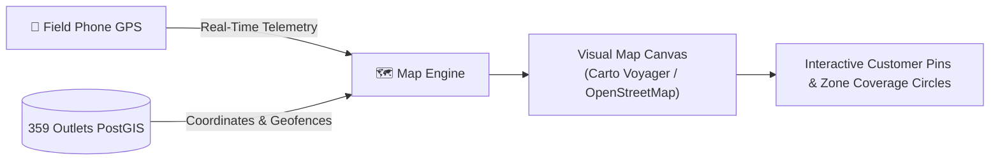

- **Purpose:** Real-time spatial tracking of field executives, customer outlet locations, and geographical coverage circles.
- **What It Displays:**
  - High-resolution interactive base map (powered by MapLibre GL & Carto Voyager).
  - Amber pins for retail outlets with popup details (DMS code, outlet name, address).
  - Circular geofence boundaries representing operational territory limits.
  - Live GPS tracking of the current user / field executive.
- **How to Use:**
  1. Click **Map** in the sidebar (`/map`).
  2. Use the Zone and Area dropdowns to isolate specific geographic clusters.
  3. Click on any outlet marker to view outlet details, pending balances, and initiate navigation.
  4. Click **Locate Me** to center the map on your live GPS position.

---

### 4.6 Visit Dispatch & Execution Tracking

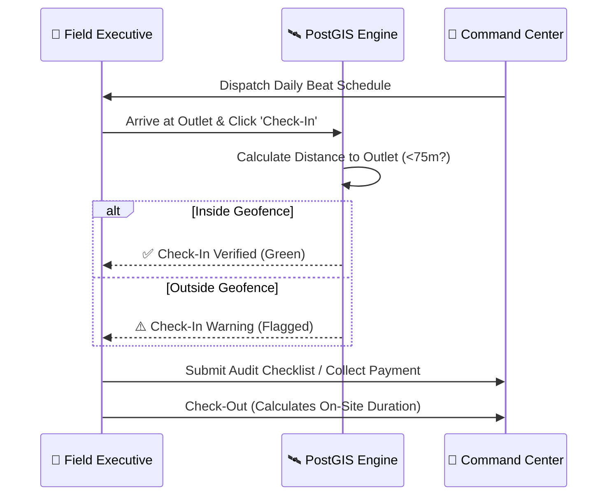

- **Purpose:** End-to-end management of field beats, scheduled client visits, on-site time tracking, and geofence compliance verification.
- **What It Displays:**
  - Status indicators: `SCHEDULED`, `IN_PROGRESS`, `COMPLETED`, `FLAGGED`, `MISSED`.
  - Check-in timestamps, check-out timestamps, and total duration spent at the customer outlet.
  - Geofence compliance badge (`VERIFIED` vs `OUT_OF_GEOFENCE`).
- **How to Use:**
  1. Navigate to `/visits`.
  2. Click **Schedule Visit** to assign an upcoming visit to a field officer.
  3. Filter by status, date, or field executive to monitor today's visit completion rate.

---

### 4.7 Geo Logs & Anti-Fraud Mock Detection

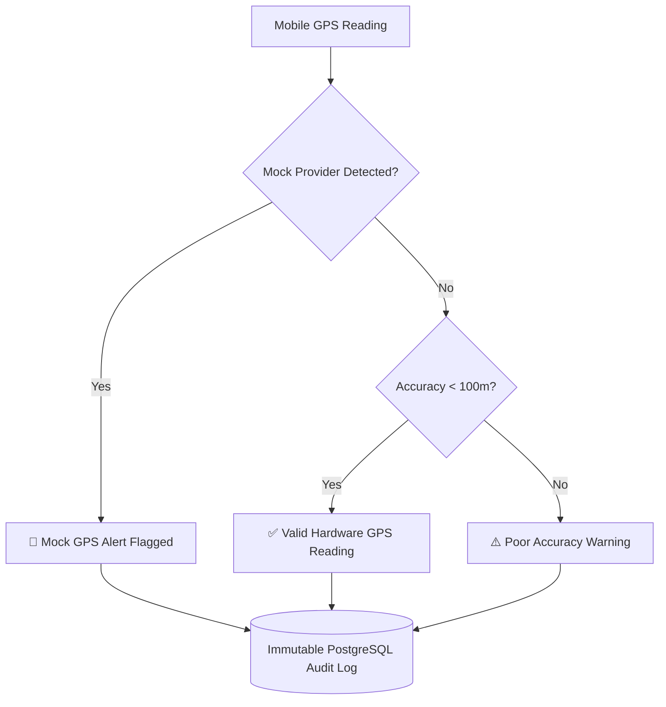

- **Purpose:** Comprehensive fraud prevention and location audit log ensuring field staff physically visit client premises.
- **What It Displays:**
  - Immutable hardware telemetry logs captured on every mobile event.
  - Device telemetry: **GPS Accuracy (meters)**, **Mock Location Flag** (detects fake GPS apps), **Battery Level**, and **Network Provider**.
- **How to Use:**
  1. Open `/geo-logs`.
  2. Review flagged entries highlighted in red/amber to investigate fraudulent attendance or spoofed check-ins.

---

### 4.8 Dynamic Requirement Form Builder

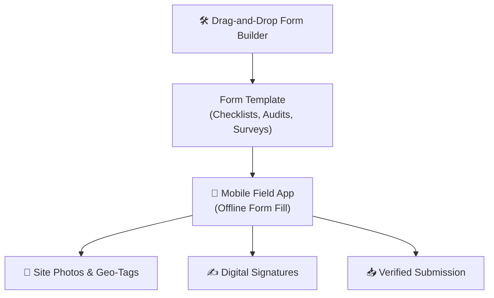

- **Purpose:** Create custom field audit forms, competitor price tracking surveys, stock verification checklists, and new customer onboarding questionnaires.
- **What It Displays:**
  - List of active form templates, question counts, and submission logs.
  - Supported question types: Short Text, Number, Dropdown, Multi-Select, Photo Upload (with EXIF geo-tag validation), and Digital Touch Signature.
- **How to Use:**
  1. Navigate to `/forms`.
  2. Click **Create New Form** to build questions and define mandatory response rules.
  3. Publish the template to immediately push it to all field executives' mobile devices.

---

### 4.9 Payment Collections & Verification Workbench

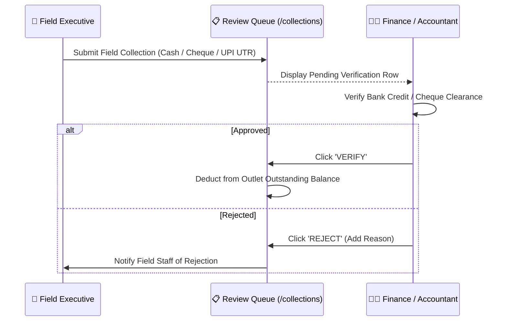

- **Purpose:** Two-tier financial verification workbench preventing revenue leakage. Field collections must be verified by the finance team before crediting customer balances.
- **What It Displays:**
  - Collection items awaiting review with payment mode (**CHEQUE**, **ONLINE / UTR**, **CASH**).
  - Instrument details: Cheque number, Bank Name, UTR reference, Receipt ID, and proof photos.
- **How to Use:**
  1. Open `/collections`.
  2. Review the list of submissions under the **Pending** tab.
  3. Click **Verify Collection** once funds reflect in the company bank account, or **Reject** with comments.

---

### 4.10 Excel / MIS Bulk Ingestion Engine

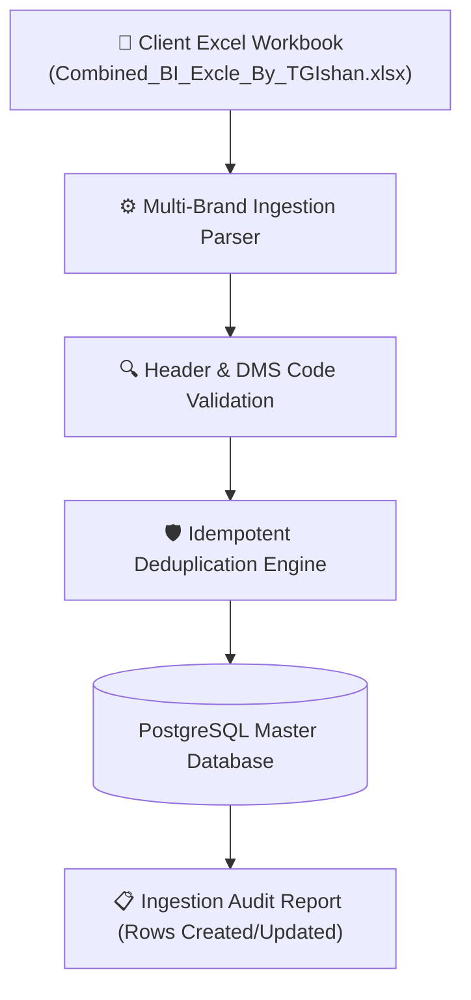

- **Purpose:** High-throughput batch ingestion pipeline to import DMS sheets, customer masters, and financial snapshots without duplicates.
- **What It Displays:**
  - Drag-and-drop Excel file upload interface supporting `.xlsx` and `.xls` files.
  - Multi-brand sheet detection (`Combined BI`, `Usha`, `VU`, `ZBR`, `Telecom`, `CE`).
  - Real-time ingestion preview, error validation, and summary logs.
- **How to Use:**
  1. Navigate to `/import`.
  2. Drag and drop the latest monthly MIS workbook into the upload dropzone.
  3. Click **Preview Data** to inspect parsed columns, then click **Commit Ingestion** to safely update balances.

---

### 4.11 Business Intelligence & Financial Reporting

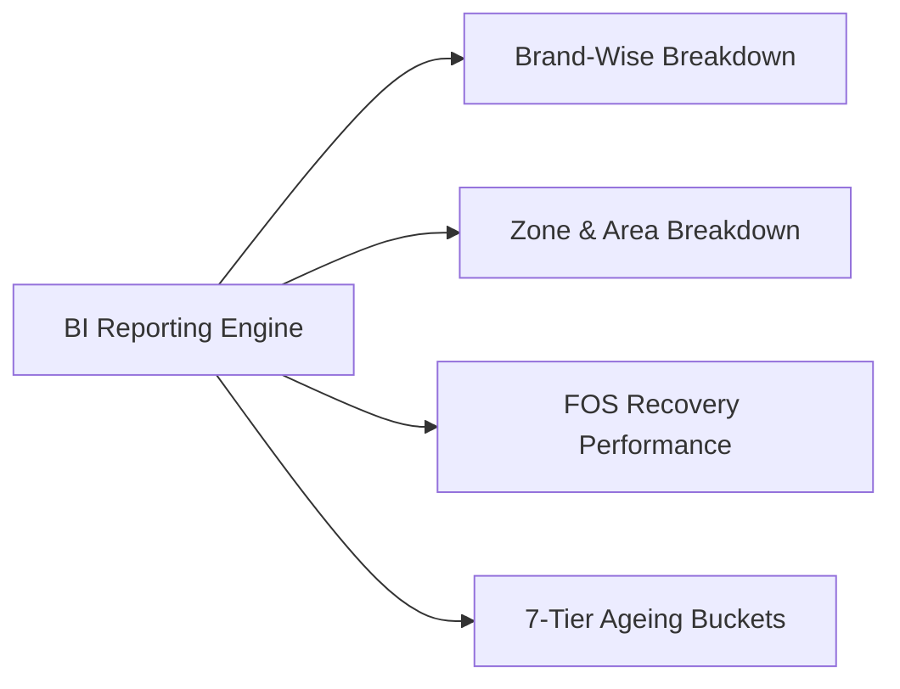

- **Purpose:** Comprehensive financial and operational analytics suite for multi-dimensional revenue analysis.
- **What It Displays:**
  1. **Brand-wise Totals:** Breakdown across client brands (e.g. Usha, VU, ZBR, Telecom).
  2. **Area-wise Summaries:** Recovery rates and market exposure sorted by geographic beats.
  3. **FOS Executive Matrix:** Collections vs Sales vs Recovery ratio for each field officer.
  4. **7-Tier Ageing Breakdown:**
     - `< 15 Days`
     - `15 – 30 Days`
     - `30 – 45 Days`
     - `45 – 60 Days`
     - `60 – 75 Days`
     - `75 – 90 Days`
     - `> 90 Days (High Risk)`
- **How to Use:**
  1. Navigate to `/reports`.
  2. Select the desired reporting tab (**Overview**, **Brand Summary**, **Zone Summary**, **FOS Matrix**, or **Ageing Ledger**).
  3. Use the filter bar to apply custom date ranges, then click **Export to Excel / CSV** for offline executive reporting.

---

### 4.12 System Diagnostics & Settings

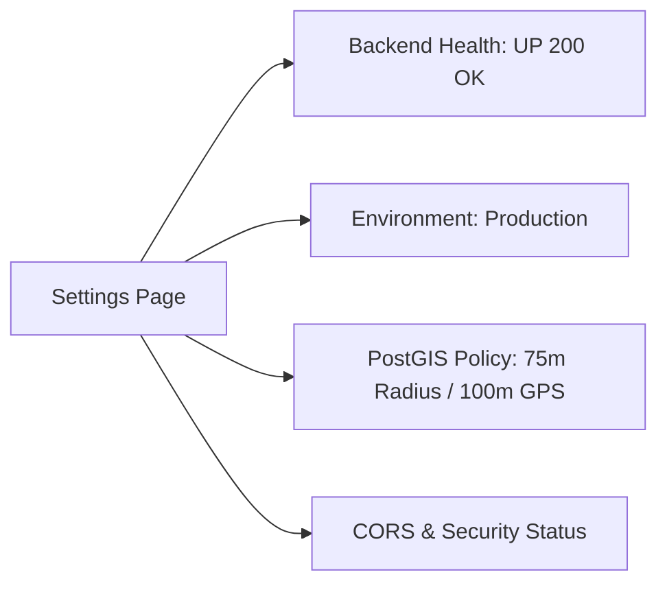

- **Purpose:** View system health, runtime environment configuration, PostGIS geofence policies, and security rules.
- **What It Displays:**
  - **API Status:** Live health check badge (`UP (200 OK)`).
  - **Active Environment:** `Production (Vercel + Render + PostgreSQL 16)`.
  - **Geofence Compliance Thresholds:** Default radius `75m`, Minimum GPS accuracy `100m`.
- **How to Use:**
  1. Click **Settings** in the bottom-left sidebar.
  2. Verify that all connectivity indicators display green status.

---

## 5. 🔄 End-to-End Operational Workflows

### Standard Daily Field Workflow
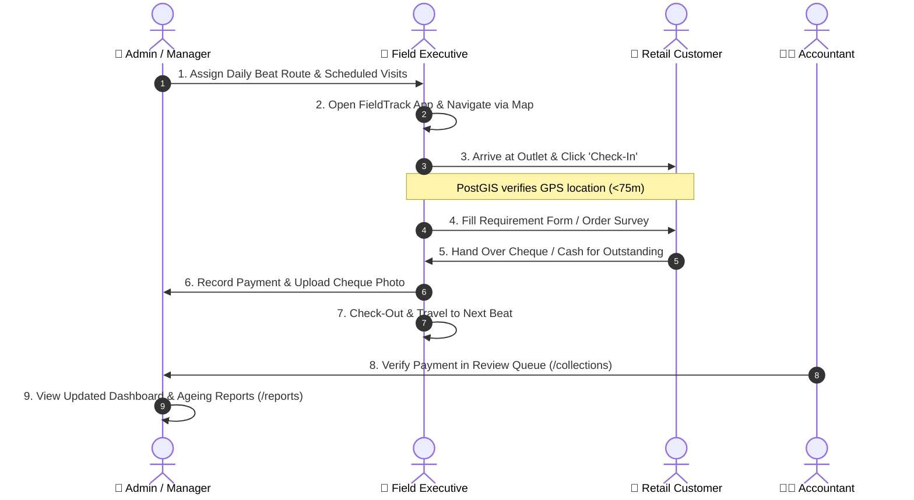

---

## 6. 📞 Support & Maintenance

- **System Version:** `v1.2.0-production`
- **Database Engine:** PostgreSQL 16 with PostGIS extension
- **Support Contact:** `admin@fieldtrack.test` / SGRG Operations Command Team
